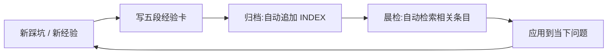

# 医疗交付团队知识库治理:从散落到可检索(L2 → L3)

> 事实边界:本案例来自作者在真实医疗信息化交付团队的 AI 赋能与知识库治理实践,已脱敏——院区名统一替换为 A/B/C,客户与厂商不点名,患者数据、原始提案表、工单、群聊记录与公司内部质检规范均不进入公开仓库。证据强度:方法论真实应用过,baseline 摘要数字为作者实测;部分数字为目标值或抽样,未达全量。不可由本仓库独立复算。

## 要验证的问题

医疗交付团队的散落知识(SQL、接口调试、踩坑经验、质检规范)无统一结构、难检索、难复用;新员工上手慢,同类问题重复踩坑。可证伪的问题:**把散落知识结构化为可检索、可复用、可持续治理的知识库,能否把搜索命中率从低基线提升到可用区间,并缩短新员工上手周期?**

## 现状评估:L0–L5 成熟度自评 = L2

采用 L0–L5 成熟度模型自评,当前为 L2(局部触及 L3)。用六维诊断刻画现状——什么算知识 / 在哪 / 怎么放 / 怎么找 / 什么能进 / 谁来管;并用四维评估 AI 落地点——AI 能看到什么 / 能做什么 / 谁能扩展 / 组织怎么变了。

六维诊断具体失衡（私有证据）：

| 维度 | 实测 | 性质 |
|---|---|---|
| 知识总量 | 892 项 | 结构性失衡起点 |
| FAQ | 12 项（1.3%） | 严重不足 |
| 接口文档 | 2 项（0.2%） | 严重不足 |
| 院区对照 | 0 项 | 完全缺失 |
| 搜索命中 | 20% | 低基线 |

六维中 4 项标🔴严重，是 L2->L3 跃迁的优先攻击面。[Private-evidence · 核验于 2026-05~06 · 不可由本仓库独立复算]

## 真实 baseline(私有证据)

| 指标 | 实测值 | 性质 | 证据强度 |
|---|---|---|---|
| 知识库搜索命中率 | 20 词命中 4(20%) | 真实基线 | Private-evidence |
| 命中率目标 | 60%+ | L2→L3 目标(未达成) | 目标 |
| 试点复测 | 70%+ | 抽样、非全量(作者自注) | Private-evidence |
| Skill 使用人数 | 当前 1 人 → 目标 5+ | 真实负向(卡在 1→3) | Private-evidence |
| 新员工上手周期 | 1–2 月 → 目标 2–3 周 | 目标(未达成) | 目标 |

> "使用者 1 人"是真实的采用负向证据:它证明的是 Skill 推广的难度,不是方法无效。引用时必须带此口径。

## 方法:两层结构 + 四维标签 + 治理五道坎

- **两层结构**:稳定层(事实 / 规范)+ 易变层(经验 / 案例),分开维护。
- **四维标签**:业务域 × 院区 × 知识类型 × 时效,支持多维检索。
- **治理五道坎**:入坎(什么能进)、审坎(谁审)、放坎(放哪)、找坎(怎么找)、退坎(过期退出)。
- **33 项 AI 场景提案**（已落地 8 项 -> 可落地 18 项，覆盖率 24% -> 55%）:按价值、难度、快速落地三维分档(高价值 / 可快速落地 / 中等投入 / 重度投入 / 不建议),给出第一批立即可做的 Skill 与后续路线,而非一次性大方案。

## 交付计划（12 周三阶段 SOW）

| 阶段 | 周次 | 重点 | 验收标准（量化） |
|---|---|---|---|
| 知识补全 | 1–4 | 结构化散落知识、补四维标签 | 搜索命中 20% -> 40% |
| Skill 扩展 | 5–8 | 高频任务封装为 Skill | 标签覆盖 0.1% -> 20%；Skill 同事 1 -> 5+ 人 |
| 跨系统集成 | 9–12 | 接口接入、知识回流 | 搜索命中 -> 60%+；标签 -> 80%+ |

资源需求：约 30 人天一次性投入 + 每月 3 人天维护。非目标：L4 决策权暂不触及；风险应对 6 项。阶段验收标准即采用验收基线，未达标不扩大。[Private-evidence · 目标值与实测混列，见 baseline 表]

## 可复用资产:经验沉淀飞轮

真实运行约半年的一套机制,把"踩过的坑"自动变成"下次能查到的资产":

- **轻索引**:一个 INDEX 表(时间、主题、院区标签),归档时自动追加一行,晨检时自动检索——不靠人记得去翻。
- **五段经验卡**:问题描述 / 根因分析 / 解决方案 / 关键经验 / 关联。
- **SQL 知识库拆分法**:把散落 SQL 按业务域 + 核心表拆分成检索友好的片段(配关键词索引),而非一坨大文件。

## 已证明 / 未证明

**已证明**:六维诊断与四维评估方法真实应用过;baseline 20% 命中率为实测;经验沉淀飞轮真实运行并持续产出经验卡;数十项提案的真实三维分档路线。

**本仓库没有证明**:60%+ 命中率(目标)、5+ 人采用(目标)、2–3 周上手(目标)、生产 ROI 与长期留存。试点 70%+ 是抽样,不是全量结论。

## 公开证据策略

原始提案表、工单、群聊记录、公司内部质检规范 PDF 均不入公开库。本页只保留脱敏后的方法、baseline 摘要数字与经验沉淀范式。院区名泛化为 A/B/C。
