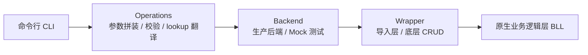

# 遗留医院信息系统基础数据配置:从 UI 三试三败到直连业务逻辑层

> 事实边界:本案例来自作者真实的医院信息系统交付工作,已脱敏——隐去真实客户、厂商名、连接凭据、患者数据与反编译产物;技术栈如实描述(基于 InterSystems IRIS + ExtJS 的主流医院信息系统),行内可推断,但不点名。证据强度:已在厂商测试库验证通过(2026-06-30),**生产环境未上线**。原始代码、测试报告与连接串不进入公开仓库,因此不可由本仓库独立复算;所有数字仅支持其所述样本与口径。

## 要验证的问题

新院区上线与日常运维,需要在医院信息系统后台手工配置科室、医护、排班、处方权、病区床位等基础数据。厂商不开放服务端 API,而前端是 ExtJS + 多层 iframe + Server Pages(CSP)架构,任何依赖 DOM 或浏览器请求拦截的自动化都不可靠。运维侧缺少批量、可审计、可回滚的配置手段。

可证伪的问题陈述:**在 ExtJS + iframe + CSP 的遗留医院信息系统上,绕过网页 UI、直连服务端业务逻辑层(BLL)做基础数据配置,能否做到与 UI 配置完全等价、可批量、可审计、可回滚?**

## 现场发现:三条 UI 自动化路径的可证伪失败

转向直连之前,作者依次实测了三条 UI 侧路径,均判定不可靠。数据来自作者真实交付环境的实测(Private-evidence;样本为作者实测,不可由本仓库独立复算):

| 路径 | 单条成功率 | 关键限制 | 证据强度 |
|---|---|---|---|
| 浏览器自动化 + 选择器 | 50–70% | stable 选择器命中 <5%,CSS 跨版本变化率 >30% | Private-evidence |
| 多模态 AI 视觉兜底 | 60–70% | 单次 ¥0.5–1、耗时 8–12 秒;规模化估算约 ¥1875/年(100 条/天 × 10% 触发) | Private-evidence |
| 抓包重放 | 0% | iframe + CSP 下网络捕获率为 0,一条请求都抓不到 | Private-evidence |

根因链:前端为 ExtJS(DOM 动态注入、自动生成 ID)+ 多层 iframe + Server Pages(非标准通信),决定了任何依赖 DOM 或浏览器请求拦截的工具都不可靠;iframe 单独就把单条成功率下拉约 30–40 个百分点。

> 以上数字是"作者环境实测"的私有证据,不是行业基准;引用时必须带此口径。

## 技术/商业定界:双路径选型

直连服务端后,厂商同时提供两类业务逻辑层入口,选型决定能否同时支持新增与改删:

| 入口 | 语义 | 适用 | 关键行为 |
|---|---|---|---|
| 厂商导入层 BLL | 一次性导入(建实体 + 级联 + 别名) | 新增 | "代码已存在"即拦截,无法用于更新 |
| 厂商底层 CRUD BLL | 按 RowId 判断新增/更新 | 改/删 | 不拦截,可改可建 |

定界结论:**新增走导入层、改删走底层 CRUD**。旧网页 UI 路径约 70% 成功,直连业务逻辑层后接近 100%(Private-evidence,作者环境)。

## 架构:四层调用链

以下架构已实现并真连测试库跑通(Confirmed,作为方法可复现):

核心约束:所有校验、事务、级联与审计仍由医院信息系统自己的 BLL 完成,工具侧只负责拼参数与透传——这保证"命令行配出来的数据与 UI 配出来的完全相同"(数据等价)。

## 真实测试证据

2026-06-30 真连厂商测试库的 live 测试结果(Private-evidence;原始 JUnit XML 不进公开库):

| 套件 | 测 / 败 / 错 / 跳过 | 时间 | 备注 |
|---|---|---|---|
| Live(真连测试库) | 6 / 0 / 0 / 1 跳过 | 2026-06-30 | 1 例 xfail,见下 |
| Smoke(字典与校验) | 12 / 0 / 0 / 0 | 2026-06-05 | — |

**xfail 归因(可迁移的方法论判断)**:被跳过的是排班用例。排班业务逻辑层内部调用日志接口,该接口隐式依赖 Web 会话变量,而命令行经 Native SDK 是进程内调用、没有 Web 会话——属"被调代码隐式依赖调用上下文",不是工具 bug。这类紧耦合是直连方案必须显式标注的边界。

## 三个可复用范式

1. **数据驱动实体扩展("新增实体 0 改 wrapper")**:实体字段、必填项、默认值、枚举、lookup 全部声明在一个 YAML 字段字典里(实测约 802 行,覆盖 11 个实体 / 13 个业务逻辑层入口 / 约 23 个命令);新增实体只需改字典与一个 operation,wrapper 不动。
2. **真连生产侧系统的无残留测试**:三层标记(Mock 默认 / Smoke 字典 / Live 真连)+ 时间戳前缀隔离(如 `LIVE_20260630_103045_`,支持环境变量重放)+ leaf→parent 自动清理 + `--keep-live-data` 调试逃生舱。清理按依赖顺序删除(床位 → 关联 → 病区 → 科室 ……),无底层删除接口的实体走原生 SDK 直删,且必须在父实体之前删。
3. **"未传即覆盖"防覆盖护栏(update ≠ PATCH)**:直接传部分字段会清空未传字段;约定先 SELECT 当前值回填,再叠加显式改动字段,并有防回归测试覆盖。

## 阶段完成度(如实)

- 阶段 0(主路径 5 实体真连):完成
- 阶段 1(反编译资产变现 + 数据驱动字典):完成
- 阶段 2(扩展到 11 实体 + 通用 dispatcher):完成
- 阶段 3(服务化 + Web 嫁接):**未落地**
- 阶段 4(批量导入 + 半成功补偿 + 审计回滚):**部分**——审计日志已做,批量与补偿未做

## 已证明 / 未证明

**已证明(在作者测试库环境)**:三条 UI 路径的可证伪失败数据;四层架构可跑通且 live 测试 6 例通过(1 例 xfail 有归因);YAML 字典驱动可低成本扩展实体;无残留测试可在真连测试库重复运行。

**本仓库没有证明**:生产环境运行、真实采用、业务 ROI、长期 SLO、第二客户复用,以及"直连方案在所有遗留医疗系统上都成立"。xfail 表明存在"被调代码隐式依赖调用上下文"的系统性边界,需逐实体发现。

## 公开证据策略

原始反编译产物、wrapper 源码、测试库连接凭据、真实客户与部署包均不进入公开仓库。本页只保留脱敏后的方法、可证伪的失败路径数据与测试摘要。若未来获得合规授权,可补"可独立复算的最小证据包"(脱敏样本 + 脚本 + 指标),类比本仓库其他案例预留的回填通道。
