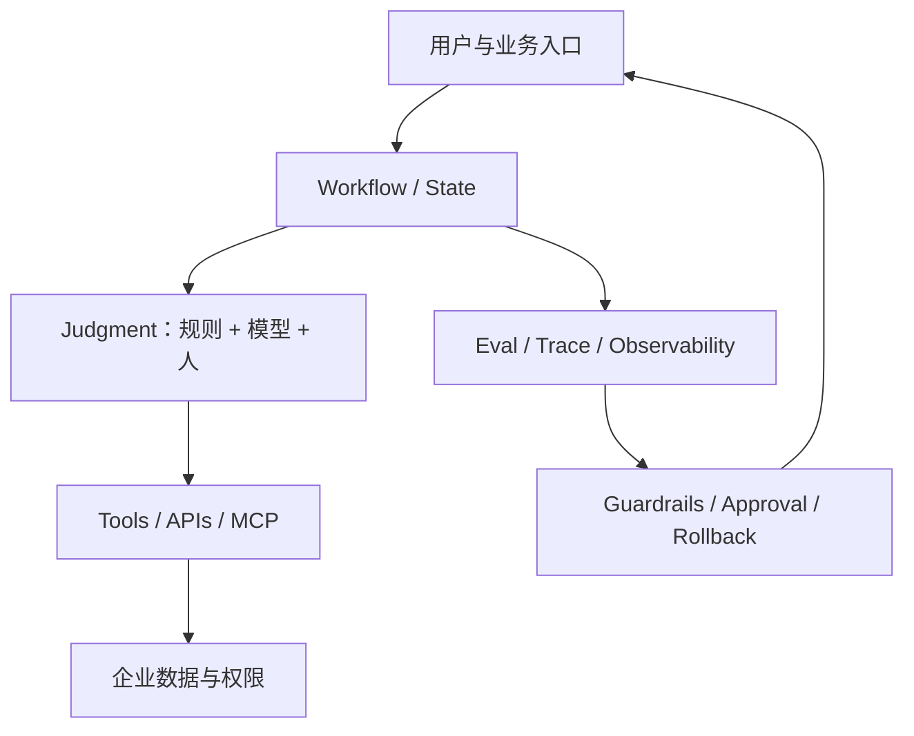

# Production Agent 参考架构

## 不从 Agent 开始，从任务开始

先判断任务应由哪种机制承担：

| 任务特征 | 优先机制 |
|---|---|
| 稳定、确定、规则清楚 | 普通软件/规则引擎 |
| 需要找权威知识 | 检索/RAG |
| 需要生成但不执行 | Copilot |
| 多步、会变化、需工具反馈 | Agent/Workflow |
| 高风险写操作 | 人工批准后的受控执行 |

## 七层结构

## 生产最小要求

- Context：企业流程、规则、历史和当前任务状态。
- Tools：明确 schema、权限、超时、重试和副作用。
- Data：权威来源、质量、版本和访问边界。
- Workflow：状态、停止条件、失败转移和恢复。
- Evaluation：离线、在线、错误分类和回归。
- Permission：最小权限、批准、审计和隔离。
- Human-in-the-loop：责任、接管、override 和反馈。

## 可靠性原则

- 能确定性完成的环节外移为代码。
- 每个失败模式至少有前馈预防或反馈纠正。
- 能力是“做到一次”，可靠性是“反复做到”。
- 不可观测、不可回放、不可回滚的 Agent 不进入关键流程。
